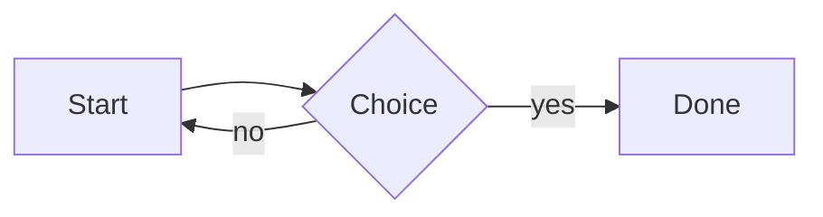
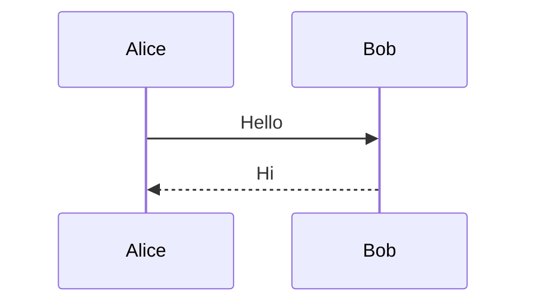
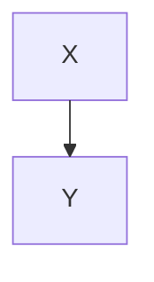

# Math and diagrams

Inline: the area is $A = \pi r^2$, and it costs $5 or $10 in shops.

$$
\int_0^1 x^2 \, dx = \frac{1}{3}
$$

```mermaid
flowchart LR
  A[Start] --> B{Choice}
  B -->|yes| C[Done]
  B -->|no| A
```

```mermaid
sequenceDiagram
  Alice->>Bob: Hello
  Bob-->>Alice: Hi
```

```mermaid
this is not a diagram
```

```mermaid
---
config:
  layout: elk
---
flowchart TD
  X --> Y
```
